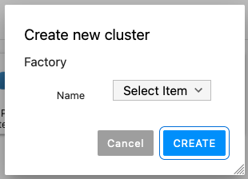
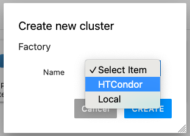

# af-plugin

This is a fork of [Dask JupyterLab Extension](https://github.com/dask/dask-labextension) to support multiple types of cluster selection as shown in the figures:



## Requirements

JupyterLab >= 3.0
distributed >= 1.24.1

## Installation

To install the Dask JupyterLab extension you will need to have JupyterLab 3.0 or greater installed.

```bash
jlpm
python3 -m pip install .
```

## Configuration of Dask cluster management

This extension has the ability to launch and manage several kinds of Dask clusters,
including local clusters and kubernetes clusters.
Options for how to launch these clusters are set via the
[dask configuration system](http://docs.dask.org/en/latest/configuration.html#configuration),
typically a `.yml` file on disk.

You can specify the list of clusters you want to show as following:

```yaml
labextension:
  factories:
    # First type of cluster (a custom class from a Python module)
    - name: "HTCondor"
      module: "dask_remote_jobqueue"
      class: "RemoteHtcondor"
      args: []
      kwargs: {}
    # Second type of cluster
    - name: "Local"
      module: "dask.distributed"
      class: "LocalCluster"
      args: []
      kwargs: {}
  # Backup options
  factory:
    module: "dask.distributed"
    class: "LocalCluster"
    args: []
    kwargs: {}
  default:
    workers: null
    adapt:
      null
      # minimum: 0
      # maximum: 10
  initial:
    []
    # - name: "My Big Cluster"
    #   workers: 100
    # - name: "Adaptive Cluster"
    #   adapt:
    #     minimum: 0
    #     maximum: 50
```

**Note**: if the field `factories` is not present, the extension will search the `factory` attribute and there will not be a menu selection but only the factory indicated will be used.
## Development install

As described in the [JupyterLab documentation](https://jupyterlab.readthedocs.io/en/stable/extension/extension_dev.html#developing-a-prebuilt-extension)
for a development install of the labextension you can run the following in this directory:

```bash
jlpm  # Install npm package dependencies
jlpm build  # Compile the TypeScript sources to Javascript
jupyter labextension develop . --overwrite  # Install the current directory as an extension
```

To rebuild the extension:

```bash
jlpm build
```

You should then be able to refresh the JupyterLab page
and it will pick up the changes to the extension.

To run an editable install of the server extension, run

```bash
pip install -e .
jupyter serverextension enable --sys-prefix dask_labextension
```
